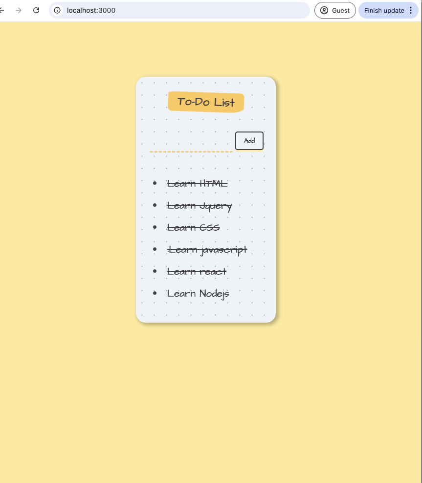

# React Todo list

## Overview
React Todo list is a simple and interactive To-Do List application built with React. It allows users to add tasks, view them in a list, and mark them as completed by clicking on them. The app demonstrates fundamental React concepts such as state management, component composition, and event handling.

## Functionality
- **Add Tasks:** Type a task in the input field and click the "Add" button to add it to your to-do list.
- **View Tasks:** All added tasks are displayed in a list below the input.
- **Mark as Done:** Click on any task to toggle its completion status (it will be crossed out when done).

## Technology Stack
- **React 16.8.6** (with Hooks)
- **react-scripts 3.2.0** (Create React App)
- **CSS** for styling (see `src/styles.css`)

## Screenshot


## How to Run Locally

1. **Clone the repository:**
   ```sh
   git clone https://github.com/Shirleysyd/To-do-list-React.git
   cd To-do-list-React
   ```
2. **Install dependencies:**
   ```sh
   npm install
   ```
3. **Start the development server:**
   ```sh
   npm start
   ```
   The app will open at [http://localhost:3000](http://localhost:3000).

> **Note:** If you encounter an OpenSSL error, the project is already configured to use the legacy provider via the `NODE_OPTIONS` environment variable in the start script.

## File Structure
- `src/components/App.jsx` - Main app logic and state
- `src/components/List.jsx` - List item component with completion toggle
- `src/styles.css` - App styling
- `doc/screenshot.png` - App screenshot

---
Enjoy using ReactMe! 